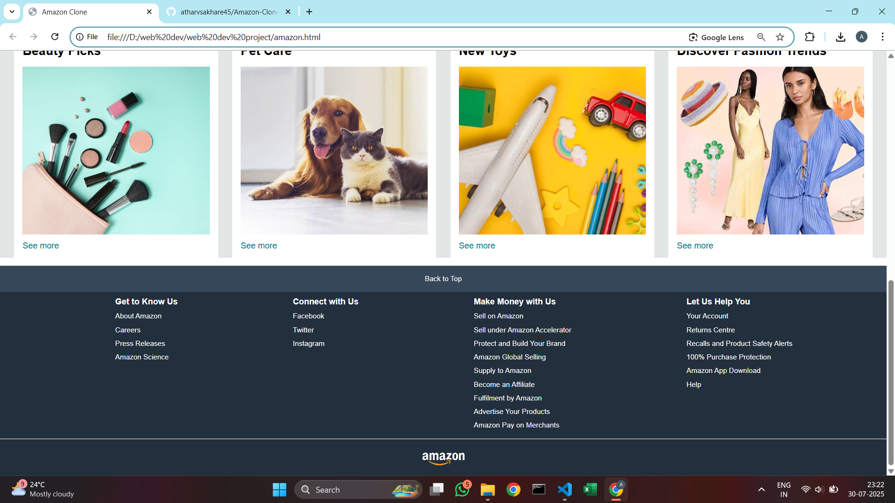
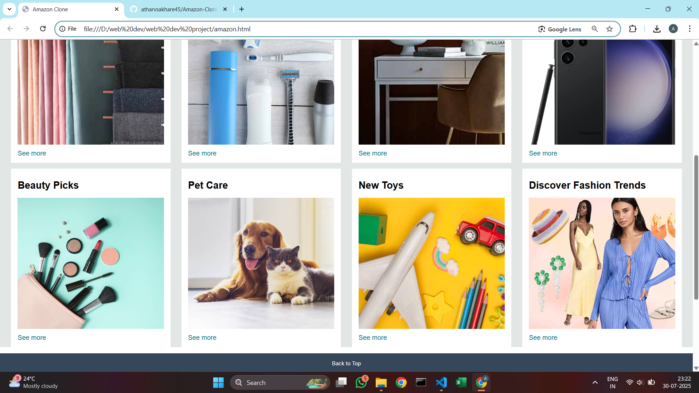

# Amazon Clone

This is a simple **Amazon website clone** built using HTML and CSS. It is a frontend-only project created for learning and practicing web development concepts like layout design, navigation bars, product displays, and responsive design.

## 💻 Technologies Used

- HTML5
- CSS3

## 📸 Preview

Here are some screenshots of the project:

  
*Homepage with header and navigation*

  
*Product grid section*

  
*Footer layout and links*

## 🚀 Features

- Responsive header with Amazon logo and navigation links
- Product cards/grid layout
- Footer with useful links
- Basic styling that mimics the Amazon UI

## 📁 Folder Structure

```
Amazon-Clone/
│
├── index.html
├── style.css
├── screenshot1.png
├── screenshot2.png
├── screenshot3.png
└── README.md
```

## 🛠️ How to Use

1. Clone the repository:
   ```bash
   git clone https://github.com/atharvsakhare45/Amazon-Clone.git
   ```

2. Open `index.html` in your browser to see the website.

## 🙌 Contributing

Pull requests are welcome! Feel free to open issues or submit improvements.

## 📄 License

This project is open source and available under the [MIT License](LICENSE).
